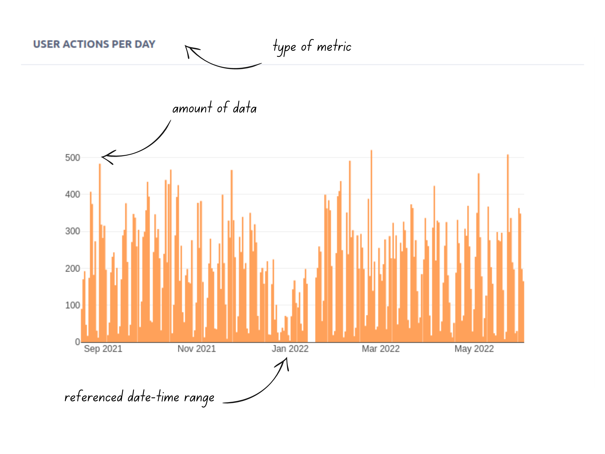
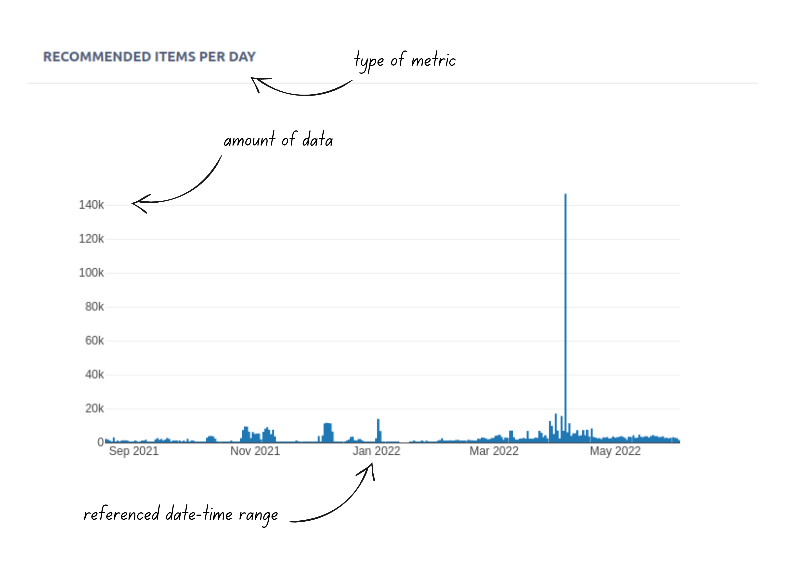

The RS Metrics software designs and exposes information graphs concerning attributes defined in the RS. The current implementation exposes:
* User Actions per day
* Recommended Items per day

## User Actions per day
Concerning this graph the x-axis shows the referenced date-time range, whereas the y-axis shows the amount of user actions occurred. The granularity of the information is per day.

## Recommended Items per day
Concerning this graph the x-axis shows the referenced date-time range, whereas the y-axis shows the amount of recommended items delivered to the users. The granularity of the information is per day.

