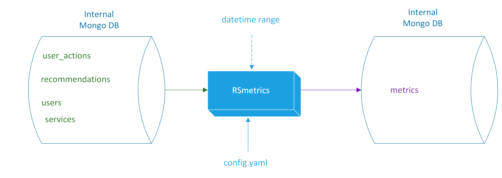

## Metrics Framework

The Recommender System (RS) is a novel component of the EOSC Portal meant to improve user experience. It provides EOSC users with recommendations concerning resources that could be of their interest, based on a multi-focal perspective of the users. Measuring the success of such system is crucial to get valuable insights in many aspects that affect user experience. In this approach, an independent metrics framework as a service is being introduced to support the evaluation and adaptation of recommendation mechanisms. The use of additional diagnostic metrics and visualizations offers deeper and sometimes surprising insights into a model’s performance. The evaluation is quantitatively being performed by processing information such as <b>resources</b>, <b>user actions</b>, <b>ratings</b>, and <b>recommendations</b> in order to measure the impact of the AI-enhanced services and user satisfaction as well as to incorporate this feedback and improve the services provided, via a user-friendly API and dashboard UI.

## Components Functionality

### Preprocessor
This module is responsible for:
* data retrieval through a connector module that claims and transforms data from various sources
* service-associated knowledge correlations
* dummy or dissociated data removal
* tagging of various associations in the data, i.e. registered or anonymous -related users and services
* generation of statistics information. 

### RS Metrics
This module is responsible for:
* processing the data
* computing the designated evaluation metrics
* producing the necessary information in a homogenized manner.

